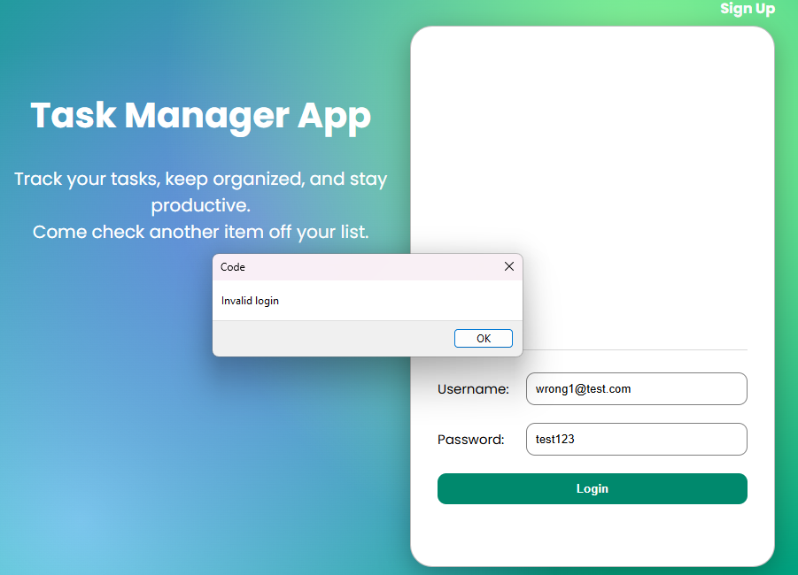
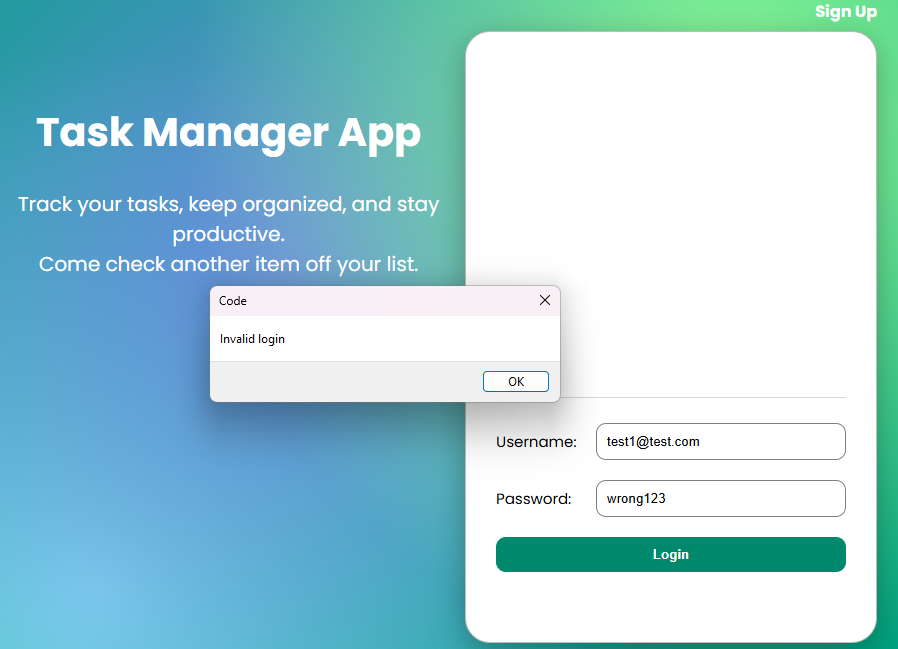
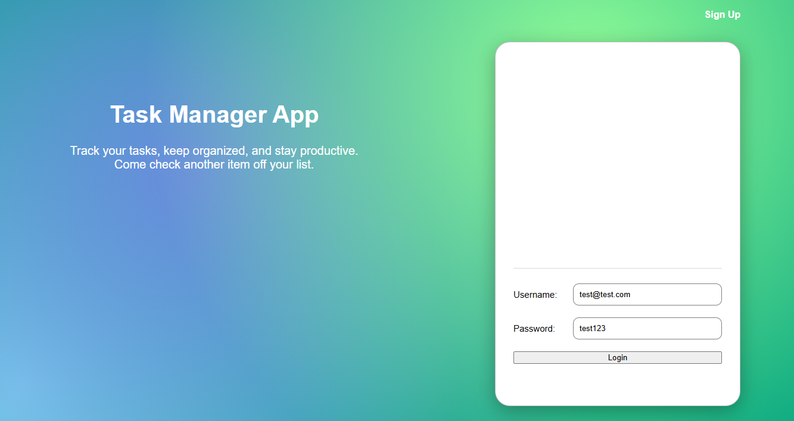
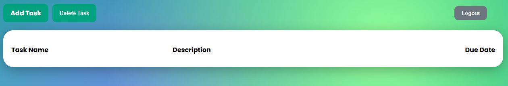
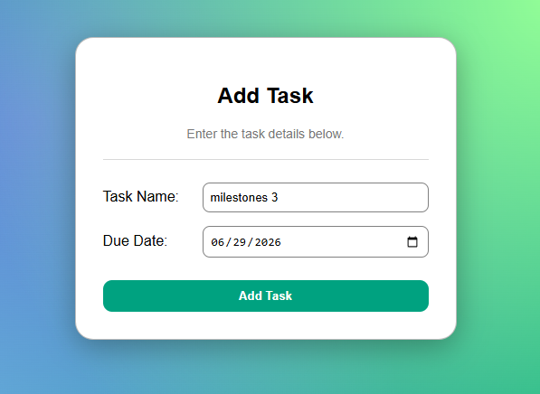
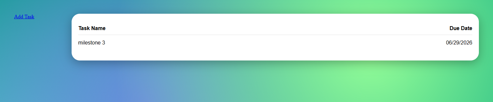
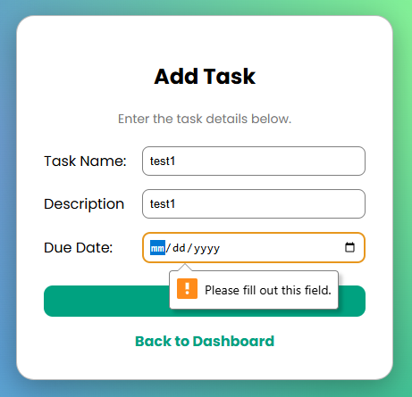
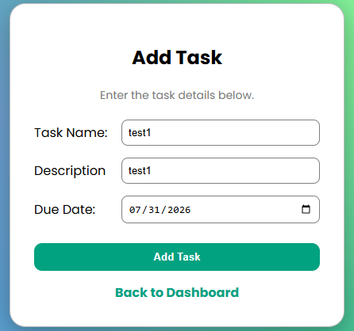
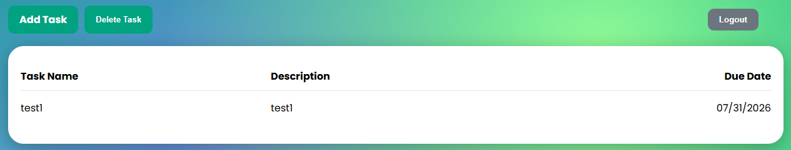

# Validation Scenarios

## Scenario 1: Create a New User Account
**Precondition:**  

**Goal:** Confirm that the application prevents access when an incorrect password is entered.

**Steps:**
1. Open the application.

**Expected Result:**  

**Actual Result:**  

**Observation:**  

**Screenshot:**  

## Scenario 2: Login with Incorrect Password

**Precondition:**  
No user is currently logged in.

**Goal:** Confirm that the application prevents access when an incorrect password is entered.

**Steps:**
1. Open the application.
2. Verify that the application redirects to the Login page.
3. Enter the email address of a registered user.
4. Enter an incorrect password.
5. Click the **Login** button.

**Expected Result:**  
The application should reject the login attempt, display an error message indicating that the credentials are invalid, and remain on the Login page.

**Actual Result:**  
The application rejected the login attempt, displayed the invalid credentials message, and did not redirect the user to the Dashboard.

**Observation:**  
This confirms that the authentication process validates the user's password before granting access to the application.

**Screenshot:**  

## Scenario 3: Login with an Unregistered Email

**Precondition:**  
No user is currently logged in.

**Goal:**  
Verify that the application prevents access when a user enters an email address that is not registered.

**Steps:**
1. Open the application.
2. Verify that the application redirects to the Login page.
3. Enter an email address that is not registered.
4. Enter any password.
5. Click the **Login** button.

**Expected Result:**  
The application should reject the login attempt, display an error message indicating that the credentials are invalid, and remain on the Login page.

**Actual Result:**  
The application rejected the login attempt, displayed the invalid credentials message, and did not redirect the user to the Dashboard.

**Observation:**  
This confirms that the authentication process verifies that the email address exists before granting access to the application.

**Screenshot:**  

## Scenario 4: User Login

**Precondition:**  
No user is currently logged in.

**Goal:**  
Verify that a registered user can successfully log in with valid credentials.

**Steps:**
1. Open the application.
2. Verify that the application redirects to the Login page.
3. Enter the email address and password of a registered user.
4. Click the **Login** button.

**Expected Result:**  
The application should authenticate the user successfully and redirect the user to the Dashboard page.

**Actual Result:**  
The application authenticated the user successfully and redirected the user to the Dashboard page.

**Observation:**  
This confirms that the authentication process validates the user's credentials, retrieves the correct user account, and grants access to the Dashboard.

**Screenshot:**  

## Scenario 5: Add Task with Missing Required Fields

**Precondition:**  
A user is logged in and is viewing the Dashboard.

**Goal:**  
Verify that the application prevents users from creating a task when any required field is left empty.

### Test Cases

| Test Case | Empty Field | Result |
|-----------|-------------|--------|
| 5.1 | Task Name | Passed |
| 5.2 | Description | Passed |
| 5.3 | Due Date | Passed |

**Steps:**
1. Open the application.
2. Log in using valid user credentials.
3. Verify that the application redirects to the Dashboard.
4. Click the **Add Task** button.
5. Leave one required field empty.
6. Complete the remaining fields with valid information.
7. Click the **Add Task** button.

**Expected Result:**  
The application should prevent the task from being created and display the browser validation message requesting that the required field be completed.

**Actual Result:**  
The application prevented the task from being created and displayed the browser validation message **"Please fill out this field."**

**Observation:**  
This confirms that the application enforces validation for all required fields before allowing a task to be created.

### Screenshots

**5.1 Missing Task Name**

**5.2 Missing Description**

**5.3 Missing Due Date**

## Scenario 6: Add New Task

**Precondition:**  
A user is logged in and is viewing the Dashboard.

**Goal:**  
Verify that a logged-in user can successfully create a new task through the GUI.

**Steps:**
1. Open the application.
2. Log in using valid user credentials.
3. Verify that the application redirects to the Dashboard.
4. Click the **Add Task** button.
5. Enter a task name.
6. Enter a task description.
7. Enter a valid due date.
8. Click the **Add Task** button.

**Expected Result:**  
The application should save the new task and redirect the user back to the Dashboard, where the newly created task is displayed in the task list.

**Actual Result:**  
The application successfully created the task, redirected the user to the Dashboard, and displayed the new task in the task list.

**Observation:**  
This confirms that the application successfully stores a new task and updates the Dashboard to display the newly created task.

### Screenshots

**Task successfully created**

**New task displayed on the Dashboard**

## Scenario 7: Display Tasks for the Logged-in User

**Precondition:**  

**Goal:** Confirm that the application prevents access when an incorrect password is entered.

**Steps:**
1. Open the application.

**Expected Result:**  

**Actual Result:**  

**Observation:**  

**Screenshot:**  

## Scenario 8: Delete Task

**Precondition:**  

**Goal:** Confirm that the application prevents access when an incorrect password is entered.

**Steps:**
1. Open the application.

**Expected Result:**  

**Actual Result:**  

**Observation:**  

**Screenshot:**  

## Scenario 9: Logout

**Precondition:**  

**Goal:** Confirm that the application prevents access when an incorrect password is entered.

**Steps:**
1. Open the application.

**Expected Result:**  

**Actual Result:**  

**Observation:**  

**Screenshot:**  
