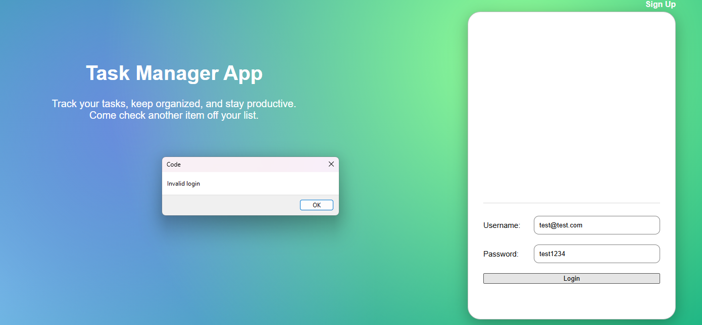

# Validation Scenarios

## Scenario 1: Login with Incorrect Password

**Goal:** Confirm that the application prevents access when an incorrect password is entered.

**Steps:**
1. Open the login page.
2. Enter a valid email.
3. Enter an incorrect password.
4. Click the Login button.

**Expected Result:**  
The user is not logged in, and an error message is displayed indicating that the credentials are invalid.

**Actual Result:**  
The application rejected the login attempt and displayed an error message.

**Observation:**  
This validates that authentication correctly checks user credentials before granting access.

**Screenshot:**  

## Scenario 2: Login with Invalid Username

**Goal:**  
Verify that the application denies access when a user enters an email that is not registered.

**Steps:**
1. Open the login page.
2. Enter an email address that is not registered.
3. Enter a valid password.
4. Click **Login**.

**Expected Result:**  
The user is not logged in, and an error message is displayed indicating that the username or password is invalid.

**Actual Result:**  
The application rejected the login attempt and displayed an error message.

**Observation:**  
The authentication process correctly verifies that the username exists before allowing access.

**Screenshot:**  

## Scenario 3: User Login

**Goal:** Confirm that a user can log in with valid credentials.

**Steps:**
1. Open the login page.
2. Enter a valid email and password.
3. Click the Login button.

**Expected Result:**  
The user is redirected to the task page.

**Actual Result:**  
The login worked correctly and the user was redirected.

**Observation:**  
This confirms the controller correctly communicates with the database and view.

**Screenshot:**  

## Scenario 4: Add Task Without a Task Name

**Goal:**  
Verify that the application prevents users from creating a task when the task name field is left empty.

**Steps:**
1. Open the login page.
2. Enter valid user credentials.
3. Click the **Login** button.
4. Confirm that the application loads the **Home Page**, where the current tasks are displayed.
5. Click the **Add Task** button/link.
6. Leave the **Task Name** field empty.
7. Enter a valid due date.
8. Click the **Add Task** button.

**Expected Result:**  
The application should not create the task and should display a validation message indicating that the task name is required.

**Actual Result:**  
The application prevented the task from being created and displayed the message **"Task name is required."**

**Observation:**  
This confirms that the application validates user input before saving a task. It also confirms the GUI flow from the Home Page to the Add Task page works correctly.

**Screenshot:** 

## Scenario 5: Add New Task

**Goal:**  
Verify that a logged-in user can add a new task through the GUI.

**Steps:**
1. Open the login page.
2. Enter valid user credentials.
3. Click the **Login** button.
4. Confirm that the application loads the **Home Page**, where current tasks are displayed.
5. Click the **Add Task** button/link.
6. Enter a task name.
7. Enter a valid due date.
8. Click the **Add Task** button.

**Expected Result:**  
The application should save the task and return the user to the Home Page or display the newly added task in the task list.

**Actual Result:**  
The task was added successfully and displayed on the Home Page.

**Observation:**  
This confirms the MVC flow: the View collects the task information, the Controller processes the request, the Model/database stores the task, and the updated task list is shown on the Home Page.

### Screenshot

